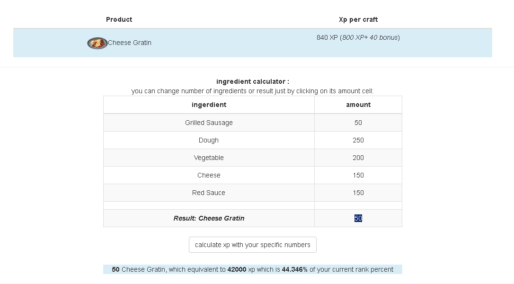
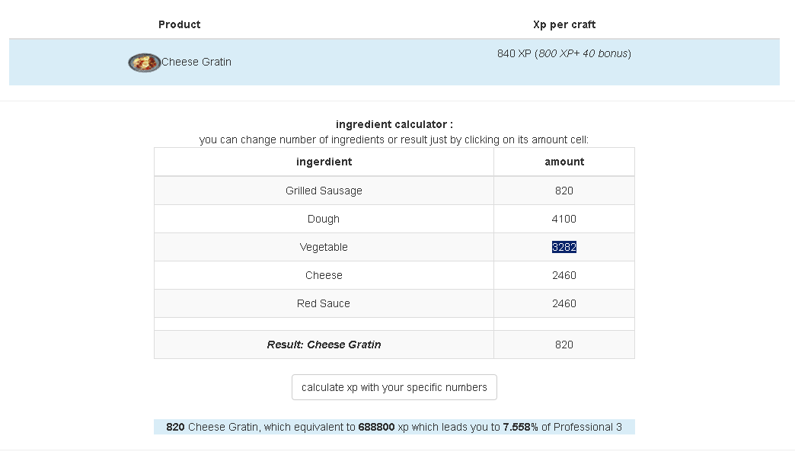
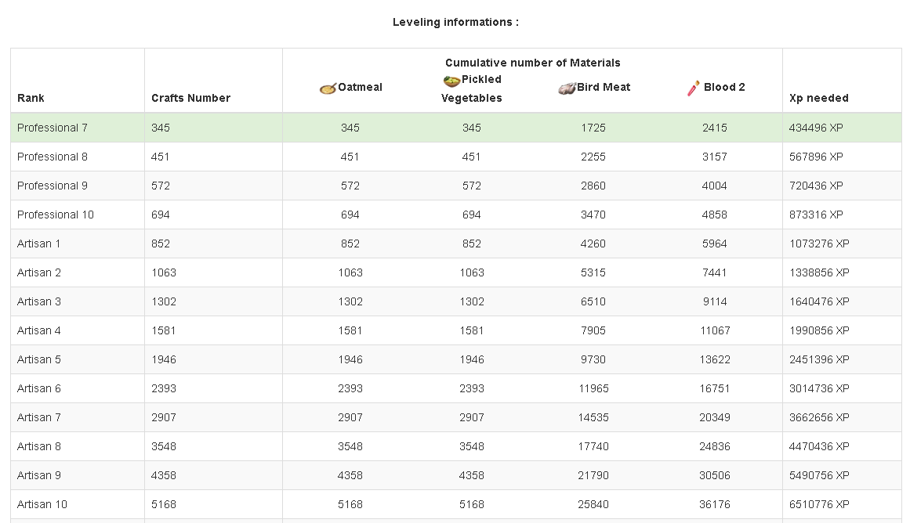

# BDO Cooking Xp Calculator

a simple web page to calculate how much crafts and cooking XP you'll need to increase your cooking rank.
also the number of aterials u need in the process

## Running 

open index.html
or https://www-drv.com/site/fqgy4zmv0sf0l1rqwcrk6g/BDCookingXpCalculator/index.html

## HOW TO USE
you can choose number of final dish and calculates its ingredients and also xp and rank you can hit with it

or calculate number of ingredients and final dish from the number of an ingredient

and finally calculate xp and ingredients you need to pass to each rank from your current one to Guru 20

thank you (if any suggestions you 're welcome)

## Authors

* **Walid LAHNINE** - *Initial work* - [BDOCookingXpCalculator](https://github.com/waliori/BDOCookingXpCalculator)

## License

This project is licensed under the MIT License - see the [LICENSE.md](LICENSE.md) file for details

